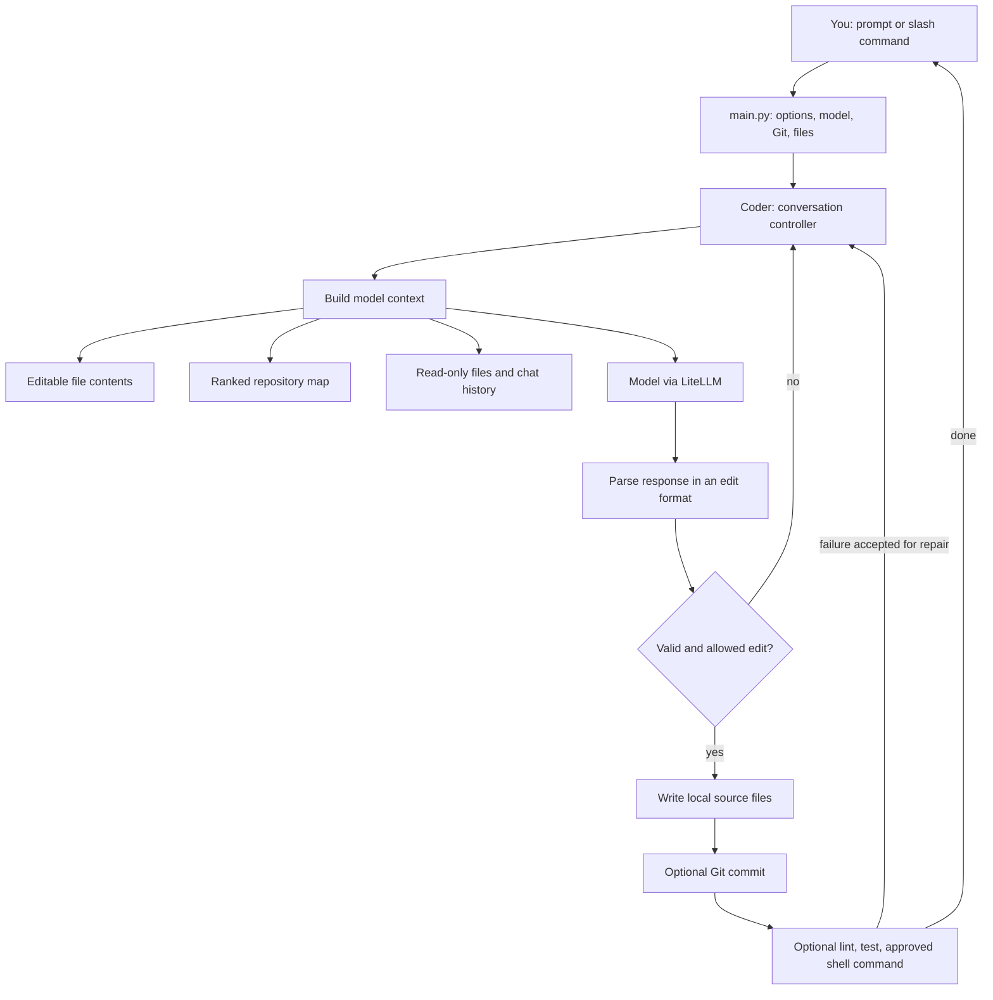

# Aider architecture: from a request to a reviewed code change

This guide explains **upstream Aider**, the terminal coding assistant in the [`aider/` submodule](aider/), then shows how this project adds isolated test execution. It follows the pinned Aider **0.86.2** checkout and our local adapter. Aider's public documentation may describe newer releases, so source links below are the authority for this checkout.

If you are new to coding agents, think of Aider as a program that runs a conversation about your repository. It chooses what code to show a language model, asks the model for changes in a specific format, checks and writes those changes to real files, then can use Git and test results to continue the conversation. The **model proposes**; the **Aider process decides what files and commands to act on**. The model does not itself have direct filesystem access through the API call.

## Start with the picture



The arrows describe a **conversation loop**, not a fixed pipeline that always runs every box. For example, `/ask` answers without editing, automatic tests run only when configured, and Git can be disabled. Aider can also ask you before adding a file, running a proposed shell command, or trying to fix a failure. The core loop is in [`Coder.run()` and `Coder.run_one()`](aider/aider/coders/base_coder.py); startup is in [`main.py`](aider/aider/main.py).

### Five words you will see often

| Term | Meaning here |
| --- | --- |
| **Chat files** | Files added for full-content context and possible editing, for example with `/add app.py`. |
| **Read-only files** | Files whose contents help the model but which are not added for editing, for example with `/read-only`. |
| **Repository map** | A compact, ranked outline of important symbols in the other Git-tracked files. It is context, not a full copy of the repo. |
| **Edit format** | The response syntax the model must use so Aider can identify and apply changes. |
| **Reflection** | A follow-up model turn containing a parse, lint, or test failure so the model can repair its proposal. |

## A single request, step by step

Imagine a Git repository with `app.py`, `storage.py`, and `tests/test_app.py`. You start Aider with `app.py` in the chat and ask it to add a `save()` call.

1. **Startup selects the environment.** [`main.py`](aider/aider/main.py) parses CLI options and config, selects a model, discovers or initializes Git, builds input/output objects, and creates a `Coder`. The `Coder` subtype depends on the model's configured edit format unless you override it. Aider is a Python application; its model calls go through the [LiteLLM wrapper](aider/aider/llm.py) and [`Model`](aider/aider/models.py).
2. **Aider decides what to show.** `app.py` enters as full text. `storage.py` may contribute a function signature and relevant lines through the repository map. A read-only `CONVENTIONS.md`, if added, enters as reference text. Prior messages and the new user request complete the model context. [`format_chat_chunks()`](aider/aider/coders/base_coder.py) assembles those parts.
3. **The model returns text.** In a `diff` session it may return a `SEARCH`/`REPLACE` block, naming `app.py` and the exact old and new lines. In `whole` mode it returns a complete replacement file. The model chooses the content; Aider parses the response according to the selected format.
4. **Aider checks before writing.** [`apply_updates()`](aider/aider/coders/base_coder.py) parses proposed edits, performs a dry-run when the format supports it, checks whether each target is allowed, and applies accepted edits. A malformed block or one that cannot match the file produces an error message that can be sent back to the model. Aider can make several reflection turns, but it caps them; it is not an unlimited self-repair loop.
5. **Optional follow-up runs.** Aider can commit its edits, lint changed files, run an approved shell command, and run `--test-cmd` when `--auto-test` is enabled. A failed check can become the next model message if you accept the repair attempt. See [`send_message()`](aider/aider/coders/base_coder.py) and [Aider's lint/test documentation](https://aider.chat/docs/usage/lint-test.html).

A schematic `diff` reply looks like this (Aider uses its exact `SEARCH`/`REPLACE` delimiters):

````text
app.py
```
[SEARCH]
print("old")
[REPLACE]
print("new")
```
````

This is a *protocol between Aider and the model*. It is not a shell command and not a Git patch applied blindly. The exact matching and file permission behavior is implemented by the [edit-block coder](aider/aider/coders/editblock_coder.py). [Aider's edit-format guide](https://aider.chat/docs/more/edit-formats.html) also describes `whole`, `diff-fenced`, and `udiff` formats.

## The main pieces of the codebase

| Source | Job | Why it matters |
| --- | --- | --- |
| [`aider/aider/main.py`](aider/aider/main.py) | CLI setup and session entry point | Connects options, model, Git, files, and coder. |
| [`aider/aider/args.py`](aider/aider/args.py) | Argument and configuration definitions | Shows which behaviors are opt-in or configurable. |
| [`aider/aider/coders/base_coder.py`](aider/aider/coders/base_coder.py) | Conversation, context, edits, reflection, and checks | The central state machine for a coding turn. |
| [`aider/aider/coders/`](aider/aider/coders/) | Editing modes and parsers | Different models can use different response formats. |
| [`aider/aider/repomap.py`](aider/aider/repomap.py) | Repository symbol extraction and ranking | Gives broad context without sending every file in full. |
| [`aider/aider/repo.py`](aider/aider/repo.py) | Git discovery, tracked files, commits and diffs | Makes changes inspectable and undoable. |
| [`aider/aider/models.py`](aider/aider/models.py) and [`llm.py`](aider/aider/llm.py) | Model settings, metadata, token handling, LiteLLM calls | Separates provider/model behavior from editing logic. |
| [`aider/aider/commands.py`](aider/aider/commands.py) | `/add`, `/drop`, `/test`, `/run`, `/git`, modes and more | Gives the human direct controls inside the chat. |
| [`aider/aider/io.py`](aider/aider/io.py) | Terminal interaction and file input/output | Mediates prompts, confirmations, display and file writes. |
| [`aider/aider/history.py`](aider/aider/history.py) | Chat summarization | Keeps older conversation useful as context grows. |
| [`aider/aider/linter.py`](aider/aider/linter.py) and [`run_cmd.py`](aider/aider/run_cmd.py) | Checks and shell execution | Important execution boundaries for local safety. |

### Why the repository map is more than a file list

Aider starts with files known to Git. For supported languages, [`RepoMap`](aider/aider/repomap.py) uses tree-sitter queries to find **definitions** and **references** such as a function definition and its callers. It builds a graph of relationships between files, ranks relevant symbols with PageRank, and renders selected source lines within a token budget. Files already in chat and names mentioned in the request influence relevance. If the chat has no full files, Aider can increase the map budget to provide more orientation. The map is refreshed and cached according to settings. [Aider's repository-map documentation](https://aider.chat/docs/repomap.html) explains the same idea visually.

Why do that? Sending every file would quickly fill the model's context and increase cost. Sending only filenames would omit the APIs and relationships needed for a cross-file change. The map sits between those extremes. It can still miss a critical detail. Use `/add path/to/file.py` when Aider needs full implementation text; use `/map` to inspect the current map. `--map-tokens` sets a **target budget**, not a strict per-request token total or a measured count of map tokens.

### Why edit formats are separate from reasoning

A good explanation does not automatically make a valid file edit. Aider therefore asks the model for changes in a syntax that a particular `Coder` subclass can parse. `diff` sends only the changed portions and can save output tokens; `whole` is simpler but repeats entire files. Model settings can pick a preferred format; `--edit-format` can override it. In **architect mode**, one model proposes a solution and an editor model translates it into file edits. This is an extra model step, so it can add time and token use. See [`ArchitectCoder`](aider/aider/coders/architect_coder.py) and [Aider's chat-mode guide](https://aider.chat/docs/usage/modes.html).

### Why Git is part of the loop

Aider is built around a Git working tree. It knows tracked files, can show diffs, commits its own edits by default, and can use `/undo` for an Aider commit. It may make a separate commit for pre-existing dirty changes before editing when that behavior is enabled. You can disable automatic commits with `--no-auto-commits`, dirty-file commits with `--no-dirty-commits`, or Git integration with `--no-git`. These are different switches. Review the exact behavior in [`GitRepo`](aider/aider/repo.py) and [Aider's Git guide](https://aider.chat/docs/git.html).

Git is a recovery and review tool here, **not a sandbox**. It does not prevent a command from reading files or using the network. Keeping a clean branch and reviewing `git diff` remains useful even when automatic commits are disabled.

### How the conversation stays within a context window

A request can include system instructions, examples of the edit format, repository map, read-only files, full chat files, earlier discussion, and the latest prompt. That total can be much larger than the prompt you typed. Aider checks estimated tokens against model metadata, and [`ChatSummary`](aider/aider/history.py) can summarize older history. A configured weak model may handle summarization and commit messages; the main model handles the coding request. Aider reports usage and may estimate cost, but provider billing and retries can differ from a local estimate. Treat the repository map's budget and total API usage as different measurements.

## What feels distinctive when using Aider

These are **design emphases visible in this checkout**, not claims that no other agent offers them.

- **A file-focused conversation.** You can explicitly choose editable files with `/add`, remove them with `/drop`, and add background context with `/read-only`. That makes the edit surface legible to a beginner. Aider can suggest adding mentioned files, but the user remains part of that decision.
- **A ranked codebase sketch.** The repository map gives the model awareness of important APIs beyond the files pasted in full. This supports targeted multi-file work within a manageable context budget.
- **Edit syntax tailored to models.** Aider separates choosing a solution from translating it into file changes, with multiple formats and optional architect/editor mode.
- **Git as everyday workflow.** Automatic commits, `/diff`, and `/undo` make reviewing each round natural. This is useful for pair programming in an existing repo.
- **Small, inspectable feedback loop.** Aider can turn an edit mismatch, linter error, or test failure into another model turn instead of treating the first response as final. You choose and configure what checks run.
- **Terminal-first human controls.** Slash commands keep file selection, modes, tests, Git and context controls in one session. For example, `/ask` can discuss a change before `/code` applies it.

The tradeoffs follow from those choices. Giving more full files raises context cost. Narrow edit formats can fail to match exact text. Auto commits add Git history you may or may not want. A shell command still runs with the host process's privileges unless an external boundary is added. Model output can be wrong even when its format is valid; tests and review are still needed.

## Upstream Aider versus this project's adapter

This repository has **two ways to run Aider**, with different boundaries:

| Mode | Where Aider edits | Where commands/tests run | Main entry point |
| --- | --- | --- | --- |
| Upstream `aider` | Your working tree | Normally on the host | [`aider.main`](aider/aider/main.py) |
| `aider-local` | Your working tree | A disposable copy in an explicitly chosen or automatically selected sandbox | [`aider_local/cli.py`](aider_local/cli.py) |
| Whole-agent demo | Inside a process sandbox, container, or microVM | In that same boundary | [`src/run.sh`](src/run.sh) |

`aider-local` is a thin adapter around pinned Aider 0.86.2. It supplies a read-only [test policy](aider_local/policy.md) and replaces the two upstream `run_cmd` references used by `/run`, `/test`, automatic tests, and approved model-suggested commands for that session. It restores the original references afterward. [Runner](aider_local/runner.py) copies a bounded snapshot of the project, chooses an available backend, executes the command there, and returns output and exit status. Changes made by a test inside that copy are discarded. Aider's own file edits, Git operations, and any explicitly enabled lint hooks still act on the host; the adapter disables auto-lint by default. See the [runbook](runbook.md) for installation and backend requirements.

`auto` for isolated tests prefers the ready rootless Podman container and otherwise uses a configured Firecracker microVM. You can pin `process-sandbox` explicitly; it is not chosen by `auto`. A task can request a specific backend with `AIDER_TEST_BACKEND=container`, `microvm`, or `process-sandbox` before a command. If that requested backend is unavailable, the runner reports an error instead of executing on the host. [The policy](aider_local/policy.md) describes how the model is asked to choose, while [the runner](aider_local/runner.py) enforces the actual choice and no-host fallback.

The whole-agent demo is a different security experiment. It runs Aider itself inside a boundary, whereas `aider-local` leaves the Aider process and source edits on the host and isolates only its shell commands. Those are different trust models. The [README](README.md) and [runbook](runbook.md) explain when each is useful.

## A first hands-on session

Once `aider-local` and a model are configured as described in the [runbook](runbook.md), try a small Git project:

```text
$ aider-local --test-backend container app.py tests/test_app.py
> /map
> /ask Where is this function used?
> /code Add input validation and a test.
> /diff
> /test python3 -m unittest discover -s tests
```

Read it this way: `app.py` and the test file are editable chat files; `/map` shows the compact view of the rest of the repo; `/ask` discusses code without editing; `/code` asks for a change; `/diff` lets you inspect it; `/test` runs the suite in a disposable container through our adapter. If you invoke **upstream** `aider` instead, `/test` uses its normal host shell runner. The standalone `aider-test` command can check your backend before starting an interactive model session.

When you need to debug a surprising result, inspect in this order: the files added to chat (`/ls`), the repository map (`/map`), the edit format printed at startup, the actual diff (`/diff` or `git diff`), then the test output. That usually tells you whether the issue was missing context, an edit-format mismatch, a model decision, or a command environment problem.
